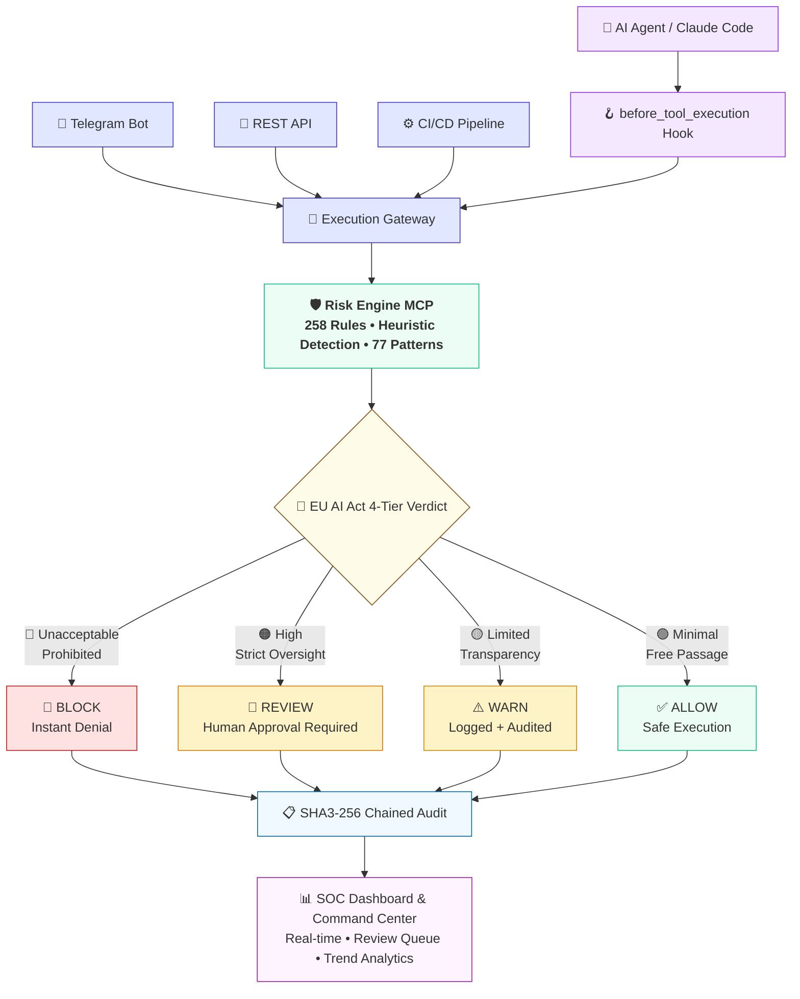

# TEOS Sovereign Sentinel — Enterprise AI Governance Architecture

## Overview

**TEOS Sovereign Sentinel (TSS)** is a real-time runtime AI governance and execution firewall. It operationalizes five runtime governance principles (Monitor, Assess, Intervene, Override, Secure) and provides the technical enforcement layer aligned with the **EU AI Act's 4-tier risk classification system**.

TSS directly addresses the **Autonomous Agent Accountability Gap**, a critical risk enterprise boards must oversee in 2026. It translates board-level risk policies into automated, deterministic, real-time code execution rules.

## Core Architecture Principle

```
Board Risk Policy → Runtime Governance Principles → EU AI Act Classification → TSS Runtime Enforcement → SHA3-256 Audit Chain
```

TSS is not a monitoring tool. It is an **execution firewall** that intercepts every agent action before it runs.

## Repository Architecture

This repository is a **lightweight orchestrator** — it contains zero service code.

| Pattern | Detail |
|---------|--------|
| Service location | `./services/<repo-name>` (gitignored, populated by `bootstrap.sh`) |
| Process management | Docker Compose via `docker-compose.yml` |
| Container orchestration | Docker Compose |
| Bootstrap (Unix) | `./bootstrap.sh` |
| Bootstrap (Windows) | `.\bootstrap.ps1` |

## Component Architecture — Runtime Enforcement



## Layer Architecture — Board-to-Operations Translation

| Layer | Component | Role | Enterprise Value |
|-------|-----------|------|------------------|
| 1 | Board Risk Policy | Enterprise AI risk appetite, acceptable/unacceptable actions definition | Governance foundation |
| 2 | Runtime Governance Principles | Monitor, Assess, Intervene, Override, Secure | Runtime AI agent governance framework |
| 3 | EU AI Act Classification | Unacceptable / High / Limited / Minimal tier mapping | Regulatory compliance |
| 4 | TSS Execution Gateway | Claude Agent hook, Telegram bot, REST API, CI/CD | Multi-surface action interception |
| 5 | TSS Risk Engine | 258 deterministic rules, heuristic suspicion (77 patterns) | Core enforcement |
| 6 | Sentinel SOC Dashboard | Real-time visibility, review queue, trend analytics | Enterprise command center |
| 7 | Audit Layer | SHA3-256 chained, SIEM-ready, AES-256-GCM optional | Board-ready compliance evidence |

## Claude Agent Integration — Production-Ready

TSS integrates with Claude Code / Claude Agent via the `before_tool_execution` hook:

```
Claude Agent → before_tool_execution → TSS Risk Scan → Traffic-Light Verdict → Execution or Block
```

Every `bash`, `write`, and `edit` call is intercepted, scanned, and either ALLOWed, WARNed, REVIEWed, or BLOCKed before execution. The decision is appended to a SHA3-256 chained audit trail.

## Traffic-Light Enforcement System

| Verdict | Signal | EU AI Act Tier | Action |
|---------|--------|----------------|--------|
| **ALLOW** | 🟢 Green | Minimal | Execute immediately, log to audit |
| **WARN** | 🟡 Yellow | Limited | Execute with logged warning |
| **REVIEW** | 🟠 Orange | High | Hold for human approval |
| **BLOCK** | 🔴 Red | Unacceptable | Instant denial, safe alternatives suggested |

## Deployment Topology

```
Internet → Cloudflare → Railway (TSS Gateway + Sentinel Dashboard)
                            ↓
                    API Gateway (Activation)
                         ↙      ↘
               Risk Engine (:8090)      Telegram Bot
               (agent-code-risk-mcp)    (teoslinker-bot)

Audit trail → SHA3-256 chained → SIEM export
```

## Local Development Ports

| Service | Port | Notes |
|---------|------|-------|
| Redis | `6379` | Internal only |
| teos-activation-service | `8080` | Billing API |
| agent-code-risk-mcp | `8090` | Risk engine |
| teoslinker-bot | `8082` | Telegram bot |
| teos-sentinel-shield | `3000` | SOC Dashboard |

## Key Design Decisions

- **Runtime governance enforcement**: First practical runtime enforcement of AI agent governance principles.
- **EU AI Act built-in**: 4-tier risk classification with corresponding ALLOW/WARN/REVIEW/BLOCK enforcement.
- **Claude Agent integration**: Production-ready `before_tool_execution` hook for real-time scanning.
- **Deterministic enforcement**: Policy is pre-defined, auditable, and versioned — not probabilistic.
- **Human-in-the-loop**: High-impact decisions (REVIEW verdict) require human approval.
- **Cryptographic audit chain**: SHA3-256 chained, SIEM-compatible, board-ready.
- **Sovereign-first**: Air-gapped deployment for governments and regulated industries.

## Security Boundaries

1. **Network** — TLS 1.3, Cloudflare WAF, DDoS protection
2. **Application** — Pre-execution scanning, rate limiting, circuit breaker
3. **Data** — AES-256 at rest, no secrets in code, `.env` gitignored
4. **Governance** — Runtime governance principles, EU AI Act alignment, board policy translation
5. **Operations** — Docker Compose, health checks, cryptographic audit logs
