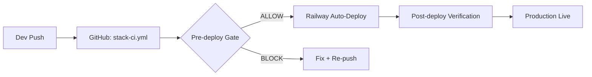

# Environment Promotion Strategy — TEOS Sentinel Shield

**Classification:** INTERNAL
**Last Updated:** 2026-06-18

---

## Environment Architecture

```
Development (Local) → CI (GitHub Actions) → Production (Railway)
```

## Environment Definitions

| Environment | Host | Purpose | Data | Secrets |
|-------------|------|---------|------|---------|
| **Development** | `localhost` (Docker) | Local testing, feature dev | Test data | Local `.env` files |
| **CI** | GitHub Actions | Build validation, test execution | None | `${{ secrets.XXX }}` |
| **Production** | Railway | Live user-facing service | Real user data | Railway env vars |

## Promotion Gates

### Dev → CI

Requirements:
- [ ] All tests pass locally
- [ ] Code builds without errors
- [ ] No hardcoded secrets (verified via `bash scripts/secret-scan.sh`)
- [ ] Commit message follows convention

### CI → Production

Requirements (enforced by `deploy.yml`):
- [ ] Pre-deploy gate passes (API reachable, no REDIS_URL in scripts, no hardcoded secrets)
- [ ] Docker build succeeds
- [ ] Post-deploy health checks pass

## Promotion Process



## Rollback Path

From Production:
1. Railway dashboard → Deployments → Redeploy last known-good
2. Or: `git revert` + push (triggers CI → deploy)
3. Full restore: `bash scripts/restore.sh`

## Versioning Strategy

- **Semantic versioning** for the orchestrator: `MAJOR.MINOR.PATCH`
- Service versions tracked independently in their own repos
- `.version.json` at root tracks orchestrator commit
- All services report engine version via `/health`
